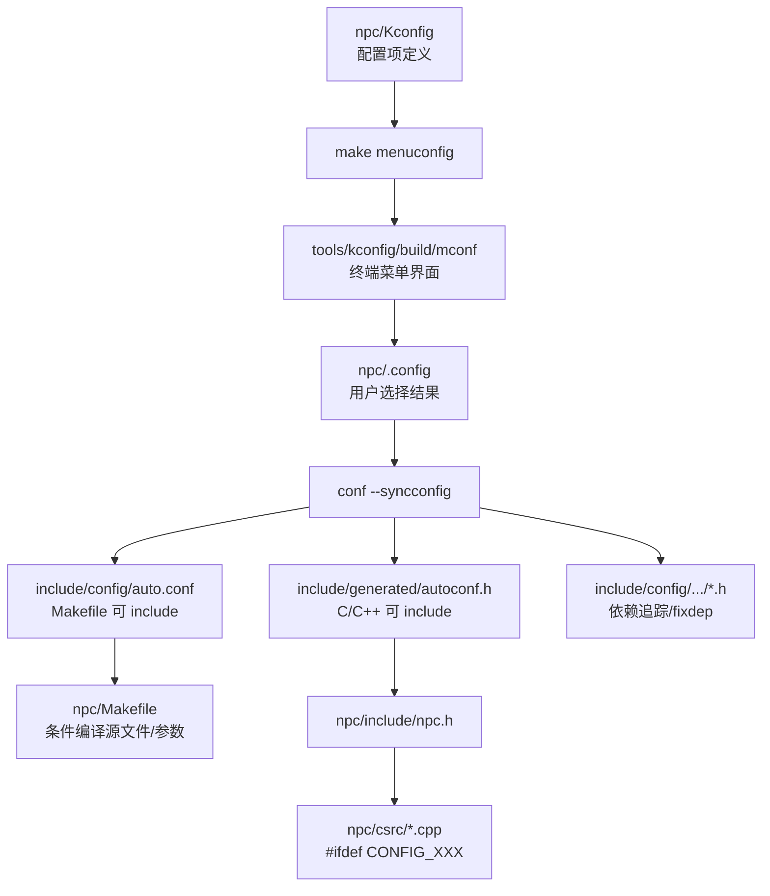
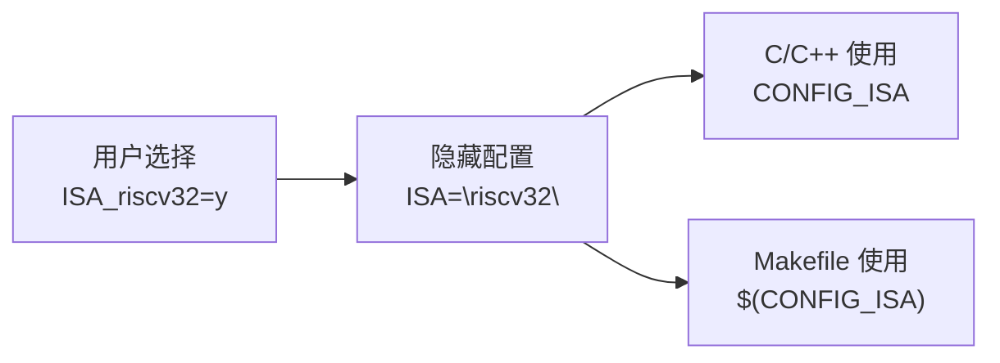
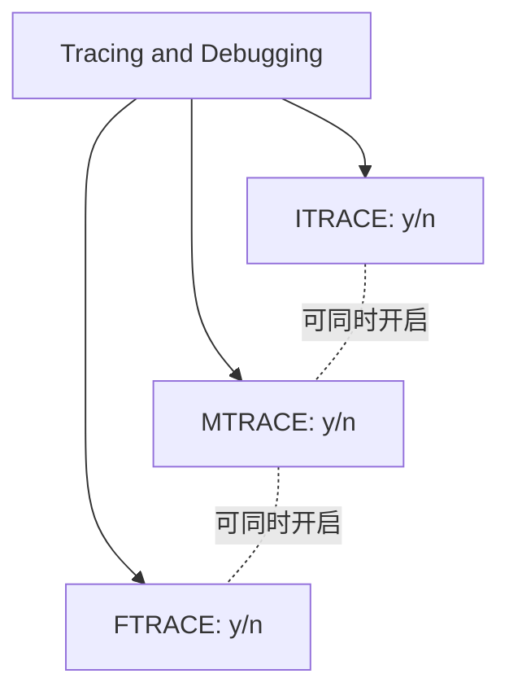
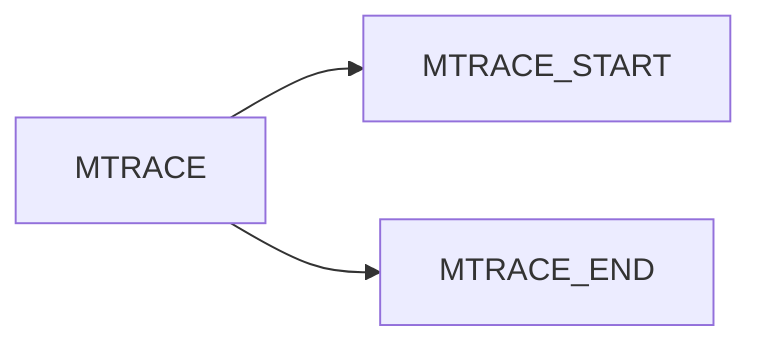
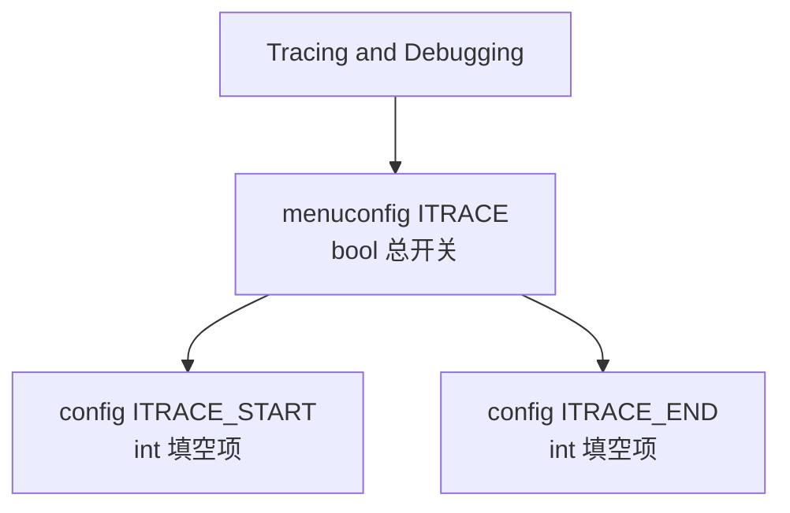
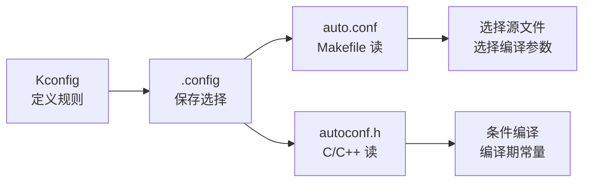

# Kconfig 配置系统笔记：从语法规范到 C/Makefile 映射

本文以 `npc` 工程中的 `Kconfig` / `scripts/config.mk` / `Makefile` / `include/generated/autoconf.h` 为主线，整理如何从 0 到 1 设计一个可用的 Kconfig 配置系统。

参考资料：

- Linux Kernel Documentation: [Kconfig Language](https://www.kernel.org/doc/html/latest/kbuild/kconfig-language.html)
- Linux Kernel Documentation: [Configuration targets and editors](https://www.kernel.org/doc/html/latest/kbuild/kconfig.html)

## 目录

- [第一部分：总览与心智模型](#1-总览与心智模型)
  - [1.1 一句话理解 Kconfig](#11-一句话理解-kconfig)
  - [1.2 NPC 配置系统总览](#12-npc-配置系统总览)
    - [1.2.1 从 menuconfig 到代码生效](#121-从-menuconfig-到代码生效)
    - [1.2.2 当前工程里的关键文件](#122-当前工程里的关键文件)
  - [1.3 工具链构建总览](#13-工具链构建总览)
    - [1.3.1 工具层：mconf / conf / fixdep](#131-工具层mconf--conf--fixdep)
    - [1.3.2 Makefile 调度层：config.mk](#132-makefile-调度层configmk)
    - [1.3.3 分发层：.config / auto.conf / autoconf.h](#133-分发层config--autoconf--autoconfh)
- [第二部分：从 0 到 1 搭建配置系统](#2-从-0-到-1-搭建配置系统)
  - [2.1 第一步：写顶层 Kconfig](#21-第一步写顶层-kconfig)
  - [2.2 第二步：接入 Makefile](#22-第二步接入-makefile)
  - [2.3 第三步：让 C/C++ include 配置结果](#23-第三步让-cc-include-配置结果)
- [第三部分：Kconfig 语法规则](#3-kconfig-语法规则)
  - [3.1 基本语法总表：顶层语句](#31-基本语法总表顶层语句)
  - [3.2 基本语法总表：配置项属性](#32-基本语法总表配置项属性)
  - [3.3 config：最基本的配置项](#33-config最基本的配置项)
  - [3.4 bool：布尔开关](#34-bool布尔开关)
    - [3.4.1 bool 的生成规则](#341-bool-的生成规则)
  - [3.5 int / hex / string：填空配置](#35-int--hex--string填空配置)
    - [3.5.1 int](#351-int)
    - [3.5.2 hex](#352-hex)
    - [3.5.3 string](#353-string)
  - [3.6 prompt：用户可见与隐藏配置](#36-prompt用户可见与隐藏配置)
  - [3.7 choice：单选](#37-choice单选)
  - [3.8 多选：多个独立 bool](#38-多选多个独立-bool)
  - [3.9 menu：菜单分组](#39-menu菜单分组)
  - [3.10 comment：标签说明](#310-comment标签说明)
  - [3.11 depends on：正向依赖](#311-depends-on正向依赖)
  - [3.12 if / endif：批量依赖](#312-if--endif批量依赖)
  - [3.13 select：反向选择](#313-select反向选择)
  - [3.14 range：限制输入范围](#314-range限制输入范围)
  - [3.15 help：缩进决定范围](#315-help缩进决定范围)
  - [3.16 source：拆分 Kconfig](#316-source拆分-kconfig)
  - [3.17 menuconfig 关键字](#317-menuconfig-关键字)
    - [3.17.1 config + if 和 menuconfig + if 的界面差别](#3171-config--if-和-menuconfig--if-的界面差别)
- [第四部分：Kconfig 的生成物与映射](#4-kconfig-的生成物与映射)
  - [4.1 Kconfig 到 C/C++：生成物格式](#41-kconfig-到-cc生成物格式)
  - [4.2 C/C++ 使用规则](#42-cc-使用规则)
  - [4.3 建议加工程内别名](#43-建议加工程内别名)
  - [4.4 Kconfig 到 Makefile 的映射](#44-kconfig-到-makefile-的映射)
    - [4.4.1 生成物格式](#441-生成物格式)
    - [4.4.2 Makefile 使用规则](#442-makefile-使用规则)
- [第五部分：NPC 当前配置项实例](#5-npc-当前配置项实例)
  - [5.1 ISA](#51-isa)
  - [5.2 Memory Configuration](#52-memory-configuration)
  - [5.3 Tracing and Debugging](#53-tracing-and-debugging)
  - [5.4 Differential Testing](#54-differential-testing)
  - [5.5 Device Configuration](#55-device-configuration)
- [第六部分：设计规范与常见坑](#6-设计规范与常见坑)
  - [6.1 命名规范](#61-命名规范)
  - [6.2 默认值规范](#62-默认值规范)
  - [6.3 依赖规范](#63-依赖规范)
  - [6.4 help 规范](#64-help-规范)
  - [6.5 常见坑](#65-常见坑)
    - [6.5.1 choice default 符号名写错](#651-choice-default-符号名写错)
    - [6.5.2 在 C 中直接用关闭后的 bool 宏](#652-在-c-中直接用关闭后的-bool-宏)
    - [6.5.3 把运行时参数放进 Kconfig](#653-把运行时参数放进-kconfig)
    - [6.5.4 重复配置来源](#654-重复配置来源)
- [第七部分：落地模板与核心心法](#7-落地模板与核心心法)
  - [7.1 Kconfig](#71-kconfig)
  - [7.2 scripts/config.mk](#72-scriptsconfigmk)
  - [7.3 Makefile](#73-makefile)
  - [7.4 C/C++ 入口头文件](#74-cc-入口头文件)
  - [7.5 C/C++ 业务代码](#75-cc-业务代码)
  - [7.6 最后的核心心法](#76-最后的核心心法)

## 1. 总览与心智模型

### 1.1 一句话理解 Kconfig

Kconfig 是一种声明式配置语言。它不负责运行程序逻辑，而是负责描述：

- 有哪些配置项；
- 配置项是什么类型；
- 用户在 `menuconfig` 里如何看到它；
- 配置之间有什么依赖关系；
- 最终生成哪些 `CONFIG_XXX` 符号；
- 这些符号如何被 C/C++ 和 Makefile 使用。

可以把它理解成：

```text
Kconfig 负责定义“配置空间”
.config 负责保存“用户选择”
auto.conf/autoconf.h 负责把选择翻译给构建系统和 C 程序
```

### 1.2 NPC 配置系统总览

#### 1.2.1 从 menuconfig 到代码生效



在当前 NPC 工程里，这条链路对应：

```text
npc/Kconfig
  -> make menuconfig
  -> npc/.config
  -> npc/include/config/auto.conf
  -> npc/include/generated/autoconf.h
  -> Makefile / C++ 代码
```

#### 1.2.2 当前工程里的关键文件

| 文件 | 角色 | 谁使用它 |
| --- | --- | --- |
| `npc/Kconfig` | 配置项源文件，定义菜单、类型、默认值、依赖 | `mconf` / `conf` |
| `npc/scripts/config.mk` | 把 Kconfig 工具接入 Makefile | `npc/Makefile` |
| `npc/.config` | 用户选择后的完整配置 | `conf --syncconfig` |
| `npc/include/config/auto.conf` | Makefile 格式的配置结果 | `npc/Makefile` |
| `npc/include/generated/autoconf.h` | C 头文件格式的配置结果 | `npc/include/npc.h` / C++ |
| `npc/include/config/...` | 每个配置符号的依赖追踪文件 | `fixdep` |

### 1.3 工具链构建总览

从软件实现层面看，NPC 的 Kconfig 配置系统可以拆成三层：

```text
工具层：mconf / conf / fixdep
调度层：npc/scripts/config.mk
分发层：.config / auto.conf / autoconf.h
```

这三层合起来完成一件事：

```text
根据 npc/Kconfig 构建 TUI 交互界面；
保存用户选择到 .config；
再把 .config 分发成 Makefile 和 C/C++ 都能读取的配置数据。
```

#### 1.3.1 工具层：mconf / conf / fixdep

NPC 当前依赖三个本地构建出来的工具：

| 工具源码目录 | 构建产物 | 核心作用 |
| --- | --- | --- |
| `npc/tools/kconfig` | `npc/tools/kconfig/build/mconf` | 根据 `Kconfig` 构建 TUI 菜单界面 |
| `npc/tools/kconfig` | `npc/tools/kconfig/build/conf` | 读取 `.config` 并同步生成配置产物 |
| `npc/tools/fixdep` | `npc/tools/fixdep/build/fixdep` | 追踪 `CONFIG_XXX` 依赖变化，辅助增量构建 |

可以这样理解：

```text
mconf：负责“给人看”和“让人选”
conf：负责“机器同步”和“生成文件”
fixdep：负责“依赖追踪”和“局部重建”
```

其中最核心的是 `mconf` 和 `conf`：

- `mconf` 解析 `npc/Kconfig`，展示 `make menuconfig` 看到的终端菜单；
- 用户保存退出后，`mconf` 会写出 `.config`；
- `conf --syncconfig` 再读取 `Kconfig + .config`，补全默认值并生成 `auto.conf` / `autoconf.h`。

#### 1.3.2 Makefile 调度层：config.mk

NPC 把 Kconfig 工具接入构建系统的位置是：

```text
npc/scripts/config.mk
```

核心变量：

```make
KCONFIG_PATH := $(NPC_HOME)/tools/kconfig
FIXDEP_PATH  := $(NPC_HOME)/tools/fixdep
Kconfig      := $(NPC_HOME)/Kconfig

CONF   := $(KCONFIG_PATH)/build/conf
MCONF  := $(KCONFIG_PATH)/build/mconf
FIXDEP := $(FIXDEP_PATH)/build/fixdep
```

核心目标：

```make
menuconfig: $(MCONF) $(CONF) $(FIXDEP)
	$(Q)$(MCONF) $(Kconfig)
	$(Q)$(CONF) -s --syncconfig $(Kconfig)
```

执行逻辑拆开看：

```text
$(MCONF) $(Kconfig)
  -> 打开 TUI 交互界面
  -> 解析 npc/Kconfig
  -> 用户勾选 bool、选择 choice、填写 int/hex/string
  -> 保存后写出 npc/.config

$(CONF) -s --syncconfig $(Kconfig)
  -> 静默同步配置
  -> 读取 npc/Kconfig 和 npc/.config
  -> 补全默认值
  -> 生成 include/config/auto.conf
  -> 生成 include/generated/autoconf.h
  -> 生成 include/config/... 依赖追踪文件
```

`%defconfig` 是非交互配置入口：

```make
%defconfig: $(CONF) $(FIXDEP)
	$(Q)$< -s --defconfig=configs/$@ $(Kconfig)
	$(Q)$< -s --syncconfig $(Kconfig)
```

这几行里同时出现了 `make` 参数、`conf` 参数和 Makefile 自动变量，需要分开理解。

首先是构建工具本身时使用的 `make` 参数：

```make
$(CONF):
	$(Q)$(MAKE) -s -C $(KCONFIG_PATH) NAME=conf

$(MCONF):
	$(Q)$(MAKE) -s -C $(KCONFIG_PATH) NAME=mconf

$(FIXDEP):
	$(Q)$(MAKE) -s -C $(FIXDEP_PATH)
```

| 写法 | 属于谁的参数 | 含义 |
| --- | --- | --- |
| `$(MAKE)` | Makefile | 递归调用 make |
| `-s` | make 参数 | silent，静默构建，减少命令打印 |
| `-C $(KCONFIG_PATH)` | make 参数 | 进入 `npc/tools/kconfig` 目录执行该目录的 Makefile |
| `-C $(FIXDEP_PATH)` | make 参数 | 进入 `npc/tools/fixdep` 目录执行该目录的 Makefile |
| `NAME=conf` | 传给子 Makefile 的变量 | 在 `tools/kconfig` 中构建 `build/conf` |
| `NAME=mconf` | 传给子 Makefile 的变量 | 在 `tools/kconfig` 中构建 `build/mconf` |

所以：

```make
$(MAKE) -s -C $(KCONFIG_PATH) NAME=conf
```

等价于：

```text
进入 npc/tools/kconfig，静默构建 conf 命令行配置程序。
```

然后是传给 `conf` 程序的参数：

```make
$(CONF) -s --syncconfig $(Kconfig)
```

这里的 `-s` 不是 make 的 `-s`，而是 `conf` 自己的静默参数。

| 写法 | 属于谁的参数 | 含义 |
| --- | --- | --- |
| `$(CONF)` | 可执行程序 | `npc/tools/kconfig/build/conf` |
| `-s` | `conf` 参数 | 静默执行，不打印普通提示 |
| `--syncconfig` | `conf` 参数 | 读取 `.config`，同步生成 `auto.conf` 和 `autoconf.h` |
| `--defconfig=configs/$@` | `conf` 参数 | 从指定 defconfig 文件生成 `.config` |
| `$(Kconfig)` | `conf` 输入文件 | 顶层 Kconfig 文件，也就是 `npc/Kconfig` |

`--syncconfig` 的语义可以理解成：

```text
读取 npc/Kconfig
读取 npc/.config
补全新增配置项的默认值
重写 npc/.config
生成 include/config/auto.conf
生成 include/generated/autoconf.h
生成 include/config/... 依赖追踪文件
```

`--defconfig=configs/$@` 的语义是：

```text
不打开 TUI 菜单；
直接读取 configs/目标名 作为预设配置；
根据这个预设配置生成 .config。
```

最后是 Makefile 自动变量：

| 自动变量 | 在 `%defconfig: $(CONF) $(FIXDEP)` 中的值 | 含义 |
| --- | --- | --- |
| `$<` | `$(CONF)` | 第一个依赖文件 |
| `$@` | 当前目标名 | 用户执行的目标名 |

例如执行：

```bash
make riscv32_defconfig
```

匹配规则：

```make
%defconfig: $(CONF) $(FIXDEP)
```

此时：

```text
$@ = riscv32_defconfig
$< = npc/tools/kconfig/build/conf
```

因此命令展开为：

```bash
npc/tools/kconfig/build/conf -s --defconfig=configs/riscv32_defconfig npc/Kconfig
npc/tools/kconfig/build/conf -s --syncconfig npc/Kconfig
```

一句话区分：

```text
make -s -C ... 是用来构建 Kconfig 工具本身；
conf -s 是静默执行 conf；
--defconfig 是从预设文件生成 .config；
--syncconfig 是从 .config 分发生成 auto.conf 和 autoconf.h。
```

结合上面的参数解释，`%defconfig` 的整体流程是：

```text
读取 configs/xxxdefconfig
  -> 生成 .config
  -> 再执行 syncconfig
  -> 生成 auto.conf / autoconf.h
```

所以两条路径可以这样对比：

| 入口 | 是否交互 | 输入 | 输出 | 适合场景 |
| --- | --- | --- | --- | --- |
| `make menuconfig` | 是 | `npc/Kconfig` + 用户选择 | `.config` + `auto.conf` + `autoconf.h` | 手动调配置 |
| `make xxxdefconfig` | 否 | `configs/xxxdefconfig` + `npc/Kconfig` | `.config` + `auto.conf` + `autoconf.h` | 预设配置、一键恢复 |

#### 1.3.3 分发层：.config / auto.conf / autoconf.h

配置保存后会生成三类核心产物：

| 文件 | 格式 | 用途 |
| --- | --- | --- |
| `npc/.config` | Kconfig 保存格式 | 用户配置的原始结果 |
| `npc/include/config/auto.conf` | Makefile 变量格式 | 给 Makefile 使用 |
| `npc/include/generated/autoconf.h` | C 头文件宏格式 | 给 C/C++ 使用 |

示例映射：

```kconfig
config ITRACE
  bool "Enable instruction trace"
  default y

config PMEM_SIZE
  hex "Physical memory size"
  default 0x8000000
```

生成 `.config`：

```make
CONFIG_ITRACE=y
CONFIG_PMEM_SIZE=0x8000000
```

生成 `auto.conf`：

```make
CONFIG_ITRACE=y
CONFIG_PMEM_SIZE=0x8000000
```

生成 `autoconf.h`：

```c
#define CONFIG_ITRACE 1
#define CONFIG_PMEM_SIZE 0x8000000
```

然后 Makefile 通过：

```make
-include $(NPC_HOME)/include/config/auto.conf
```

拿到 `CONFIG_XXX` 变量。

C/C++ 通过：

```c
#include <generated/autoconf.h>
```

拿到 `CONFIG_XXX` 宏。

最终可以把 Kconfig 软件层的构建核心总结为：

```text
Kconfig 软件层构建的核心，是先通过 tools/kconfig 构建 mconf/conf，
再由 scripts/config.mk 提供 make menuconfig 调度入口。
mconf 根据 npc/Kconfig 构建 TUI 交互界面并保存 .config；
conf --syncconfig 根据 Kconfig + .config 同步生成 auto.conf 和 autoconf.h；
Makefile 通过 auto.conf 获取 CONFIG_xxx 变量；
C/C++ 通过 autoconf.h 获取 CONFIG_xxx 宏。
```

## 2. 从 0 到 1 搭建配置系统

### 2.1 第一步：写顶层 `Kconfig`

最小版本：

```kconfig
mainmenu "NPC Configuration Menu"

config ITRACE
  bool "Enable instruction trace"
  default y
  help
    Record PC and instruction for each executed instruction.
```

结构含义：

| 语句 | 作用 |
| --- | --- |
| `mainmenu` | 设置 menuconfig 顶层标题，通常放在文件开头 |
| `config ITRACE` | 定义一个配置符号，最终生成 `CONFIG_ITRACE` |
| `bool` | 这个配置是布尔开关 |
| `"Enable instruction trace"` | 用户在 menuconfig 中看到的提示文本 |
| `default y` | 默认开启 |
| `help` | 帮助文本，给使用者解释选项含义 |

### 2.2 第二步：接入 Makefile

NPC 当前使用 `scripts/config.mk` 接入配置工具：

```make
include $(NPC_HOME)/scripts/config.mk
-include $(NPC_HOME)/include/config/auto.conf
```

其中：

- `include scripts/config.mk`：提供 `make menuconfig` 目标；
- `-include include/config/auto.conf`：读取 Kconfig 生成的 Makefile 变量；
- 前面的 `-` 表示文件不存在时不报错，适合第一次配置前的状态。

`scripts/config.mk` 的核心逻辑是：

```make
menuconfig: $(MCONF) $(CONF) $(FIXDEP)
	$(Q)$(MCONF) $(Kconfig)
	$(Q)$(CONF) -s --syncconfig $(Kconfig)
```

这里分两步：

1. `mconf $(Kconfig)` 打开 menuconfig 界面，让用户选择；
2. `conf --syncconfig $(Kconfig)` 根据 `.config` 同步生成 `auto.conf` 和 `autoconf.h`。

### 2.3 第三步：让 C/C++ include 配置结果

在 C/C++ 侧，需要包含：

```c
#include <generated/autoconf.h>
```

NPC 当前在 `npc/include/npc.h` 中这样做：

```c
#include <generated/autoconf.h>

#define RESET_VECTOR CONFIG_RESET_VECTOR
#define PMEM_SIZE    CONFIG_PMEM_SIZE
```

这样做有两个好处：

- 业务代码可以使用更短、更语义化的 `RESET_VECTOR`；
- Kconfig 的 `CONFIG_` 前缀集中在一个入口头文件里，后续维护更清楚。

## 3. Kconfig 语法规则

### 3.1 基本语法总表：顶层语句

| 语句 | 作用 | 是否生成 `CONFIG_XXX` | NPC 中是否使用 |
| --- | --- | --- | --- |
| `mainmenu` | 设置配置界面标题 | 否 | 是 |
| `config` | 定义一个配置项 | 是 | 是 |
| `menuconfig` | 定义一个带子菜单倾向的配置项 | 是 | 当前未用 |
| `menu` / `endmenu` | 菜单分组 | 否 | 是 |
| `choice` / `endchoice` | 单选组 | 组内 `config` 会生成 | 是 |
| `comment` | 显示说明文字 | 否 | 当前可考虑使用 |
| `if` / `endif` | 批量附加依赖条件 | 否 | 当前未用 |
| `source` | 拆分并引入其他 Kconfig 文件 | 否 | 当前未用 |

### 3.2 基本语法总表：配置项属性

| 属性 | 例子 | 作用 |
| --- | --- | --- |
| `bool` | `bool "Enable ITRACE"` | 布尔开关，值为 `y` 或 `n` |
| `tristate` | `tristate "Build driver"` | 三态，值为 `y/m/n`，Linux 模块常用，NPC 通常不用 |
| `int` | `int "Cycle limit"` | 十进制整数输入 |
| `hex` | `hex "Reset vector"` | 十六进制输入 |
| `string` | `string "ISA name"` | 字符串输入 |
| `prompt` | `prompt "Enable trace"` | 显示给用户看的文字 |
| `default` | `default y` | 默认值 |
| `depends on` | `depends on MTRACE` | 正向依赖，决定是否可见/可选 |
| `select` | `select ITRACE` | 反向选择，强制选中另一个符号 |
| `range` | `range 0 10000` | 限制 `int/hex` 输入范围 |
| `help` | `help ...` | 帮助文本 |

### 3.3 `config`：最基本的配置项

标准格式：

```kconfig
config SYMBOL
  type "prompt"
  default value
  depends on EXPR
  help
    Help text.
```

例子：

```kconfig
config ITRACE
  bool "Enable instruction trace"
  default y
  help
    Record PC and instruction value for each executed instruction.
```

生成结果：

```c
#define CONFIG_ITRACE 1
```

```make
CONFIG_ITRACE=y
```

注意：在 Kconfig 中定义符号时，不写 `CONFIG_` 前缀。也就是说：

```kconfig
config ITRACE
```

最终会自动生成：

```text
CONFIG_ITRACE
```

不要写成：

```kconfig
config CONFIG_ITRACE
```

否则最终会变成 `CONFIG_CONFIG_ITRACE`，这就乱套了。

### 3.4 `bool`：布尔开关

`bool` 是最常用的类型，用来表示功能开关。

```kconfig
config DIFFTEST
  bool "Enable differential testing"
  default y
```

#### 3.4.1 bool 的生成规则

| 用户选择 | `.config` | `auto.conf` | `autoconf.h` |
| --- | --- | --- | --- |
| 开启 | `CONFIG_DIFFTEST=y` | `CONFIG_DIFFTEST=y` | `#define CONFIG_DIFFTEST 1` |
| 关闭 | `# CONFIG_DIFFTEST is not set` | 通常不出现 | 通常不定义 |

所以在 C/C++ 里，布尔配置推荐这样使用：

```c
#ifdef CONFIG_DIFFTEST
  init_difftest();
#endif
```

不推荐：

```c
if (CONFIG_DIFFTEST) {
  init_difftest();
}
```

因为关闭时 `CONFIG_DIFFTEST` 可能根本没有定义，直接引用会编译失败。

在 Makefile 里推荐：

```make
ifeq ($(CONFIG_DIFFTEST),y)
CSRCS += csrc/difftest/dut.cpp
endif
```

### 3.5 `int` / `hex` / `string`：填空配置

这三类配置会在 menuconfig 中表现为可输入的值。

#### 3.5.1 `int`

```kconfig
config ITRACE_END
  int "ITRACE end cycle"
  default 10000
```

生成：

```c
#define CONFIG_ITRACE_END 10000
```

适合表示：

- cycle 数；
- 数组深度；
- 最大连接数；
- 可调阈值。

#### 3.5.2 `hex`

```kconfig
config RESET_VECTOR
  hex "Reset vector (PC start address)"
  default 0x80000000
```

生成：

```c
#define CONFIG_RESET_VECTOR 0x80000000
```

适合表示：

- 地址；
- MMIO 基址；
- memory size；
- mask。

#### 3.5.3 `string`

```kconfig
config ISA
  string
  default "riscv32" if ISA_riscv32
```

生成：

```c
#define CONFIG_ISA "riscv32"
```

适合表示：

- ISA 名；
- 默认文件名；
- target 名称；
- 工具链前缀。

### 3.6 `prompt`：用户可见与隐藏配置

有 prompt 的配置会显示给用户：

```kconfig
config ITRACE
  bool "Enable instruction trace"
```

等价于：

```kconfig
config ITRACE
  bool
  prompt "Enable instruction trace"
```

没有 prompt 的配置不会显示给用户，称为隐藏配置：

```kconfig
config ISA
  string
  default "riscv32" if ISA_riscv32
```

隐藏配置常用于“派生值”：



这种设计可以把“用户选择项”和“程序需要的具体值”解耦。

### 3.7 `choice`：单选

单选使用 `choice` / `endchoice`。

```kconfig
choice
  prompt "Base ISA"
  default ISA_riscv32

config ISA_riscv32
  bool "riscv32I"

config ISA_riscv64
  bool "riscv64I"

endchoice
```

特点：

- 同一组里只能选一个；
- `default` 必须指向真实存在的 `config` 符号；
- 组内选项通常是 `bool`；
- 适合架构、平台、模式、后端等互斥选择。

NPC 当前 `Kconfig` 中这一段需要特别留意：

```kconfig
choice
  prompt "Base ISA"
  default ISA_riscv32I
config ISA_riscv32
  bool "riscv32I"
endchoice
```

这里 `default ISA_riscv32I` 和实际符号 `ISA_riscv32` 不一致。更规范的写法是：

```kconfig
choice
  prompt "Base ISA"
  default ISA_riscv32

config ISA_riscv32
  bool "riscv32I"

endchoice
```

如果之后加入 `riscv64`，推荐写成：

```kconfig
choice
  prompt "Base ISA"
  default ISA_riscv32

config ISA_riscv32
  bool "riscv32I"

config ISA_riscv64
  bool "riscv64I"

endchoice

config ISA
  string
  default "riscv32" if ISA_riscv32
  default "riscv64" if ISA_riscv64
```

这样代码中可以统一使用 `CONFIG_ISA`。

### 3.8 多选：多个独立 `bool`

Kconfig 中没有专门的“checkbox group”语法。多选通常就是多个独立的 `bool` 配置。

```kconfig
menu "Tracing and Debugging"

config ITRACE
  bool "Enable instruction trace"
  default y

config MTRACE
  bool "Enable memory trace"
  default n

config FTRACE
  bool "Enable function trace"
  default n

endmenu
```

这表示：

| 配置 | 是否可与其他同时开启 |
| --- | --- |
| `ITRACE` | 可以 |
| `MTRACE` | 可以 |
| `FTRACE` | 可以 |

选择模型：



如果是互斥关系，用 `choice`；如果是可组合关系，用多个 `bool`。

### 3.9 `menu`：菜单分组

`menu` 只负责组织界面，不生成 `CONFIG_XXX`。

```kconfig
menu "Memory Configuration"

config RESET_VECTOR
  hex "Reset vector (PC start address)"
  default 0x80000000

config PMEM_SIZE
  hex "Physical memory size (bytes)"
  default 0x8000000

endmenu
```

菜单分组适合按模块划分：

```text
ISA Configuration
Memory Configuration
Tracing and Debugging
Differential Testing
Device Configuration
```

如果一个菜单整体依赖某个条件，可以写：

```kconfig
menu "MTRACE Options"
  depends on MTRACE

config MTRACE_START
  int "MTRACE start cycle"
  default 0

config MTRACE_END
  int "MTRACE end cycle"
  default 10000

endmenu
```

`menu` 块内的配置会继承这个依赖。

### 3.10 `comment`：标签说明

`comment` 只显示文字，不生成配置项。

```kconfig
comment "Waveform is controlled by make run / make vcd"
```

适合用于：

- 提醒某些功能不由 Kconfig 控制；
- 标记实验性配置；
- 在某个条件不满足时给出提示。

例如：

```kconfig
comment "MTRACE options are hidden because MTRACE is disabled"
  depends on !MTRACE
```

### 3.11 `depends on`：正向依赖

`depends on` 表示“我依赖某个条件”。依赖不满足时，配置项不可见或不可选。

```kconfig
config MTRACE_START
  int "MTRACE start cycle"
  default 0
  depends on MTRACE
```

含义：

```text
只有 CONFIG_MTRACE=y 时，用户才需要配置 MTRACE_START。
```

依赖关系图：



多个依赖可以写：

```kconfig
depends on DIFFTEST && ISA_riscv32
```

表达式支持：

| 表达式 | 含义 |
| --- | --- |
| `A` | A 为 y/m 时成立 |
| `!A` | A 不成立 |
| `A && B` | A 和 B 同时成立 |
| `A || B` | A 或 B 成立 |
| `A = B` | 两个符号值相等 |
| `A != B` | 两个符号值不等 |
| `A >= B` | 数值比较 |

### 3.12 `if` / `endif`：批量依赖

如果很多配置都依赖同一个条件，不必每个都写 `depends on`，可以用 `if` 块：

```kconfig
if MTRACE

config MTRACE_START
  int "MTRACE start cycle"
  default 0

config MTRACE_END
  int "MTRACE end cycle"
  default 10000

endif
```

等价于：

```kconfig
config MTRACE_START
  int "MTRACE start cycle"
  default 0
  depends on MTRACE

config MTRACE_END
  int "MTRACE end cycle"
  default 10000
  depends on MTRACE
```

设计建议：

- 配置很少时，用 `depends on` 更直观；
- 一组配置明显属于同一功能时，用 `if` 更整洁。

### 3.13 `select`：反向选择

`select` 表示“选中我时，自动选中别人”。

```kconfig
config DIFFTEST
  bool "Enable differential testing"
  select ITRACE
```

含义：

```text
DIFFTEST=y 会强制 ITRACE=y
```

但是 `select` 要谨慎。官方文档强调：`select` 会强制设置目标符号，可能绕过目标符号自己的依赖。因此更推荐：

```kconfig
config DIFFTEST
  bool "Enable differential testing"
  depends on ITRACE
```

两者区别：

| 写法 | 语义 | 风险 |
| --- | --- | --- |
| `depends on ITRACE` | 我需要 ITRACE，用户必须先开 ITRACE | 安全，依赖清晰 |
| `select ITRACE` | 我开启后强制打开 ITRACE | 可能绕过 ITRACE 自己的依赖 |

经验规则：

```text
表达“我依赖谁”：优先 depends on
表达“我需要打开底层隐藏能力”：谨慎 select
```

### 3.14 `range`：限制输入范围

`range` 用于 `int` 和 `hex`：

```kconfig
config ITRACE_END
  int "ITRACE end cycle"
  range 0 100000000
  default 10000
```

```kconfig
config RESET_VECTOR
  hex "Reset vector"
  range 0x80000000 0x8fffffff
  default 0x80000000
```

它能防止用户填出明显不合理的值。

NPC 里的 `IMEM_SIZE` / `DMEM_SIZE` 未来可以考虑加：

```kconfig
config IMEM_SIZE
  int "Instruction memory depth (32-bit words)"
  range 1024 1048576
  default 65536
```

### 3.15 `help`：缩进决定范围

`help` 文本由缩进决定结束位置：

```kconfig
config PMEM_SIZE
  hex "Physical memory size (bytes)"
  default 0x8000000
  help
    Default 128MB (0x0800_0000). Must be large enough to hold
    the full .bin image.

config IMEM_SIZE
  int "Instruction memory depth"
```

`help` 下面的文本必须比 `help` 本身缩进更深。当缩进回到同级时，帮助文本结束。

好的 help 应该写：

- 单位；
- 默认值含义；
- 修改它会影响什么；
- 合法范围或注意事项。

不好的 help：

```text
Enable this option.
```

好的 help：

```text
Record each memory read/write with address, length and data.
This may slow down simulation and generate large log files.
```

### 3.16 `source`：拆分 Kconfig

项目变大后，可以拆分：

```kconfig
mainmenu "NPC Configuration Menu"

source "Kconfig.isa"
source "Kconfig.memory"
source "Kconfig.trace"
source "Kconfig.device"
```

推荐结构：

```text
npc/
  Kconfig
  Kconfig.isa
  Kconfig.memory
  Kconfig.trace
  Kconfig.device
```

注意：`source` 的路径要基于执行 Kconfig 工具时的工作目录或工具约定。NPC 当前直接传入 `$(NPC_HOME)/Kconfig`，拆分时建议先在本地验证路径解析。

### 3.17 `menuconfig` 关键字

不要把 `make menuconfig` 和 Kconfig 里的 `menuconfig SYMBOL` 混淆。

| 名称 | 含义 |
| --- | --- |
| `make menuconfig` | Makefile 目标，启动配置界面 |
| `menuconfig SYMBOL` | Kconfig 语法，定义一个带子选项展示倾向的配置符号 |

例子：

```kconfig
menuconfig TRACE
  bool "Enable tracing support"
  default y

if TRACE

config ITRACE
  bool "Enable instruction trace"
  default y

config MTRACE
  bool "Enable memory trace"
  default n

endif
```

这表示：

- `TRACE` 是总开关；
- `ITRACE` / `MTRACE` 是它下面的子选项；
- 关闭 `TRACE` 时，子选项整体不可见。

#### 3.17.1 `config + if` 和 `menuconfig + if` 的界面差别

这是 NPC 中 `ITRACE/MTRACE` 很容易踩到的细节。

如果只写：

```kconfig
config ITRACE
  bool "Enable instruction trace"
  default y

if ITRACE

config ITRACE_START
  int "ITRACE start cycle"
  default 0

config ITRACE_END
  int "ITRACE end cycle"
  default 10000

endif
```

这套写法在语义上是正确的：

- `ITRACE_START` / `ITRACE_END` 依赖 `ITRACE`；
- 当 `ITRACE=n` 时，这两个填空项会隐藏；
- 当 `ITRACE=y` 时，这两个填空项会生效。

但是在 `menuconfig` 界面中，它们通常仍然显示在当前菜单的同一层级，看起来像这样：

```text
[*] Enable instruction trace
[ ] Enable memory trace
[ ] Enable function trace
(0) ITRACE start cycle
(10000) ITRACE end cycle
```

也就是说，`if ITRACE` 主要表达“条件可见/条件生效”，不保证界面上把子配置缩进到 `ITRACE` 这个 bool 下面。

如果希望界面层级表现为“`ITRACE` 是一个可展开的总开关，下面挂着 start/end 参数”，应该把父项写成 `menuconfig`：

```kconfig
menuconfig ITRACE
  bool "Enable instruction trace"
  default y
  help
    记录每条指令的PC和指令字到itrace日志文件。

if ITRACE

config ITRACE_START
  int "ITRACE start cycle"
  default 0

config ITRACE_END
  int "ITRACE end cycle"
  default 10000

endif
```

这时 `menuconfig` 前端会更倾向于把 `ITRACE` 当作一个带子项的菜单节点展示。界面逻辑可以理解为：



对比总结：

| 写法 | 依赖语义 | 界面层级 | 适合场景 |
| --- | --- | --- | --- |
| `config ITRACE` + `if ITRACE` | 正确 | 子项可能仍显示在同一层 | 只关心条件可见，不关心界面分组 |
| `menuconfig ITRACE` + `if ITRACE` | 正确 | 子项更自然地挂在父项下面 | 父项是功能总开关，下面有参数 |
| `config ITRACE_START` + `depends on ITRACE` | 正确 | 通常仍是同层显示 | 参数少、层级不重要 |

因此，NPC 中 `ITRACE` / `MTRACE` 这种“bool 开关 + start/end 参数”的结构，推荐使用：

```kconfig
menuconfig ITRACE
  bool "Enable instruction trace"
  default y

if ITRACE
config ITRACE_START
  int "ITRACE start cycle"
  default 0

config ITRACE_END
  int "ITRACE end cycle"
  default 10000
endif
```

`MTRACE` 同理。

## 4. Kconfig 的生成物与映射

### 4.1 Kconfig 到 C/C++：生成物格式

Kconfig：

```kconfig
config PMEM_SIZE
  hex "Physical memory size"
  default 0x8000000

config ITRACE
  bool "Enable instruction trace"
  default y

config ISA
  string
  default "riscv32"
```

生成 `include/generated/autoconf.h`：

```c
#define CONFIG_PMEM_SIZE 0x8000000
#define CONFIG_ITRACE 1
#define CONFIG_ISA "riscv32"
```

### 4.2 C/C++ 使用规则

| 配置类型 | C/C++ 推荐写法 |
| --- | --- |
| `bool` | `#ifdef CONFIG_ITRACE` |
| `int` | `CONFIG_ITRACE_END` |
| `hex` | `CONFIG_RESET_VECTOR` |
| `string` | `CONFIG_ISA` |

示例：

```c
#ifdef CONFIG_ITRACE
void trace_inst(uint32_t pc, uint32_t inst) {
  fprintf(itrace_fp, "%08x: %08x\n", pc, inst);
}
#endif
```

```c
uint8_t npc_pmem[CONFIG_PMEM_SIZE];
```

```c
printf("ISA = %s\n", CONFIG_ISA);
```

### 4.3 建议加工程内别名

```c
#define RESET_VECTOR CONFIG_RESET_VECTOR
#define PMEM_SIZE    CONFIG_PMEM_SIZE
```

这样业务代码不必处处感知 Kconfig 细节。

### 4.4 Kconfig 到 Makefile 的映射

#### 4.4.1 生成物格式

Kconfig：

```kconfig
config DIFFTEST
  bool "Enable differential testing"
  default y

config ISA
  string
  default "riscv32"
```

生成 `include/config/auto.conf`：

```make
CONFIG_DIFFTEST=y
CONFIG_ISA="riscv32"
```

#### 4.4.2 Makefile 使用规则

| 目的 | 写法 |
| --- | --- |
| 根据 bool 添加源文件 | `ifeq ($(CONFIG_DIFFTEST),y)` |
| 根据 bool 添加编译选项 | `CFLAGS += -DCONFIG_XXX` 通常不需要，因为 C 已 include `autoconf.h` |
| 使用字符串 | `$(CONFIG_ISA)` |
| 使用数字 | `$(CONFIG_PMEM_SIZE)` |

示例：

```make
CSRCS = $(shell find csrc/ -name "*.cpp")

ifeq ($(CONFIG_DIFFTEST),y)
CSRCS += csrc/difftest/dut.cpp
endif

ifeq ($(CONFIG_ITRACE),y)
SIM_CFLAGS += -DENABLE_ITRACE_LOG
endif
```

注意：如果 C/C++ 已经包含 `generated/autoconf.h`，通常不需要再手动 `-DCONFIG_ITRACE`。否则会形成两套配置来源，容易不一致。

## 5. NPC 当前配置项实例

### 5.1 ISA

```kconfig
choice
  prompt "Base ISA"
  default ISA_riscv32

config ISA_riscv32
  bool "riscv32I"

endchoice

config ISA
  string
  default "riscv32" if ISA_riscv32
```

设计意图：

- `choice` 给用户选择 ISA；
- `ISA_riscv32` 是用户可见选项；
- `ISA` 是隐藏派生值，给代码和 Makefile 使用。

### 5.2 Memory Configuration

```kconfig
config RESET_VECTOR
  hex "Reset vector (PC start address)"
  default 0x80000000

config PMEM_SIZE
  hex "Physical memory size (bytes)"
  default 0x8000000
```

设计意图：

- 地址类用 `hex`；
- 容量如果常用十六进制表达，也可用 `hex`；
- 进入 C 后可直接作为编译期常量。

当前映射：

```c
#define RESET_VECTOR CONFIG_RESET_VECTOR
#define PMEM_SIZE    CONFIG_PMEM_SIZE
```

### 5.3 Tracing and Debugging

```kconfig
menuconfig ITRACE
  bool "Enable instruction trace"
  default y

if ITRACE

config ITRACE_START
  int "ITRACE start cycle"
  default 0

config ITRACE_END
  int "ITRACE end cycle"
  default 10000

endif

menuconfig MTRACE
  bool "Enable memory trace"
  default n

if MTRACE

config MTRACE_START
  int "MTRACE start cycle"
  default 0

config MTRACE_END
  int "MTRACE end cycle"
  default 10000

endif
```

设计意图：

- `ITRACE/MTRACE/FTRACE` 是开关；
- `*_START` / `*_END` 是参数；
- 参数项最好依赖对应开关；
- 如果希望参数在 menuconfig 界面中挂在 bool 总开关下面，父项应使用 `menuconfig`，不是普通 `config`。

普通依赖写法：

```kconfig
config ITRACE_START
  int "ITRACE start cycle"
  default 0
  depends on ITRACE

config ITRACE_END
  int "ITRACE end cycle"
  default 10000
  depends on ITRACE
```

这能表达依赖关系，但界面上参数项可能仍然显示在同一层。当前 NPC 对 trace 参数更推荐：

```kconfig
menuconfig ITRACE
  bool "Enable instruction trace"
  default y

if ITRACE

config ITRACE_START
  int "ITRACE start cycle"
  default 0

config ITRACE_END
  int "ITRACE end cycle"
  default 10000

endif
```

核心差别：

```text
depends on / if 解决“什么时候可见、什么时候生效”
menuconfig 解决“这个 bool 是否作为带子项的菜单节点展示”
```

### 5.4 Differential Testing

```kconfig
config DIFFTEST
  bool "Enable differential testing"
  default y
```

设计意图：

- 控制是否编译/运行 DiffTest；
- Makefile 可以根据它决定是否加入 difftest 源文件；
- C++ 可以根据它决定是否初始化 ref。

### 5.5 Device Configuration

```kconfig
config HAS_SERIAL
  bool "Serial port (UART)"
  default y

config HAS_TIMER
  bool "Timer"
  default n
```

设计意图：

- `HAS_` 表示硬件/设备是否存在；
- C++ 设备模型和 RTL 外设接口可以基于它条件编译。

## 6. 设计规范与常见坑

### 6.1 命名规范

| 类型 | 推荐命名 | 例子 |
| --- | --- | --- |
| 功能开关 | `FEATURE` | `ITRACE` |
| 是否有设备 | `HAS_DEVICE` | `HAS_SERIAL` |
| 平台能力 | `HAVE_FEATURE` | `HAVE_MMU` |
| 编译器能力 | `CC_HAS_FEATURE` | `CC_HAS_BUILTIN_EXPECT` |
| 大小 | `XXX_SIZE` | `PMEM_SIZE` |
| 地址 | `XXX_BASE` / `XXX_VECTOR` | `RESET_VECTOR` |
| 范围 | `XXX_START` / `XXX_END` | `ITRACE_START` |
| 派生字符串 | `XXX` | `ISA` |

### 6.2 默认值规范

Linux Kconfig 的习惯是：新功能默认 `n`，避免无意增大构建内容。但对教学项目或已有默认功能，可以根据工程需要设置 `default y`。

NPC 中可以这样判断：

| 配置 | 推荐默认值 | 原因 |
| --- | --- | --- |
| `ITRACE` | `y` 或 `n` 均可 | 教学调试期可默认开，追求速度时默认关 |
| `MTRACE` | `n` | 日志量大，影响性能 |
| `FTRACE` | `n` | 依赖 ELF/符号解析时再开 |
| `DIFFTEST` | `y` | NPC 验证核心功能，默认开有利于发现错误 |
| `HAS_SERIAL` | `y` | 基础设备，常用 |
| `HAS_TIMER` | `n` | 后续实现后再打开 |

### 6.3 依赖规范

优先使用：

```kconfig
depends on
```

谨慎使用：

```kconfig
select
```

推荐：

```kconfig
config FTRACE
  bool "Enable function trace"
  depends on ELF_LOADER
```

不推荐随便写：

```kconfig
config FTRACE
  bool "Enable function trace"
  select ELF_LOADER
```

除非 `ELF_LOADER` 是隐藏的、没有复杂依赖的底层能力。

### 6.4 help 规范

每个非显然配置最好写 help，尤其是：

- memory size；
- reset vector；
- trace 开关；
- difftest；
- 设备开关。

模板：

```kconfig
help
  One-line summary.
  Unit: bytes/cycles/words.
  Default: xxx.
  Note: changing this may affect xxx.
```

### 6.5 常见坑

#### 6.5.1 `choice default` 符号名写错

错误：

```kconfig
default ISA_riscv32I

config ISA_riscv32
  bool "riscv32I"
```

正确：

```kconfig
default ISA_riscv32
```

`default` 后面写的是符号名，不是 prompt 文本。

#### 6.5.2 在 C 中直接用关闭后的 bool 宏

危险：

```c
if (CONFIG_MTRACE) {
  ...
}
```

安全：

```c
#ifdef CONFIG_MTRACE
  ...
#endif
```

因为关闭时 `CONFIG_MTRACE` 通常不会被定义。

#### 6.5.3 把运行时参数放进 Kconfig

不适合：

- 本次运行的 bin 文件路径；
- 本次是否打开波形；
- 本次日志输出目录。

适合：

- 是否支持波形功能；
- 是否编译 trace 逻辑；
- 默认内存大小；
- 是否启用设备模型。

当前 NPC 中波形由 `make run` / `make vcd` 控制，这是合理的。

#### 6.5.4 重复配置来源

不要同时：

- 在 Kconfig 里定义 `CONFIG_ITRACE`；
- 又在 Makefile 中手写 `-DCONFIG_ITRACE`；
- 又在某个头文件里手写默认值。

推荐唯一来源：

```text
Kconfig -> autoconf.h / auto.conf -> C / Makefile
```

## 7. 落地模板与核心心法

### 7.1 `Kconfig`

```kconfig
mainmenu "NPC Configuration Menu"

choice
  prompt "Base ISA"
  default ISA_riscv32

config ISA_riscv32
  bool "riscv32I"

endchoice

config ISA
  string
  default "riscv32" if ISA_riscv32

menu "Memory Configuration"

config RESET_VECTOR
  hex "Reset vector (PC start address)"
  default 0x80000000

config PMEM_SIZE
  hex "Physical memory size (bytes)"
  default 0x8000000

endmenu

menu "Tracing and Debugging"

config ITRACE
  bool "Enable instruction trace"
  default y

config ITRACE_START
  int "ITRACE start cycle"
  default 0
  depends on ITRACE

config ITRACE_END
  int "ITRACE end cycle"
  default 10000
  depends on ITRACE

endmenu
```

### 7.2 `scripts/config.mk`

```make
KCONFIG_PATH := $(NPC_HOME)/tools/kconfig
Kconfig      := $(NPC_HOME)/Kconfig

CONF  := $(KCONFIG_PATH)/build/conf
MCONF := $(KCONFIG_PATH)/build/mconf

$(CONF):
	$(MAKE) -s -C $(KCONFIG_PATH) NAME=conf

$(MCONF):
	$(MAKE) -s -C $(KCONFIG_PATH) NAME=mconf

menuconfig: $(MCONF) $(CONF)
	$(MCONF) $(Kconfig)
	$(CONF) -s --syncconfig $(Kconfig)

.PHONY: menuconfig
```

### 7.3 `Makefile`

```make
NPC_HOME = $(shell pwd)

include $(NPC_HOME)/scripts/config.mk
-include $(NPC_HOME)/include/config/auto.conf

CSRCS = $(shell find csrc/ -name "*.cpp")

ifeq ($(CONFIG_DIFFTEST),y)
CSRCS += csrc/difftest/dut.cpp
endif
```

### 7.4 C/C++ 入口头文件

```c
#ifndef __NPC_H__
#define __NPC_H__

#include <generated/autoconf.h>

#define RESET_VECTOR CONFIG_RESET_VECTOR
#define PMEM_SIZE    CONFIG_PMEM_SIZE

#endif
```

### 7.5 C/C++ 业务代码

```c
#ifdef CONFIG_ITRACE
trace_inst(pc, inst);
#endif

uint8_t npc_pmem[PMEM_SIZE];
```

### 7.6 最后的核心心法



写 Kconfig 时，始终分清三件事：

1. `Kconfig` 只描述配置，不写业务逻辑；
2. Makefile 根据 `auto.conf` 决定怎么构建；
3. C/C++ 根据 `autoconf.h` 决定怎么编译和运行。

如果一个选项会影响“是否编译、编译什么、编译期常量是多少”，它适合放进 Kconfig。

如果一个选项只是“这一次运行传什么参数”，它更适合放在命令行、Makefile 目标或程序参数里。
